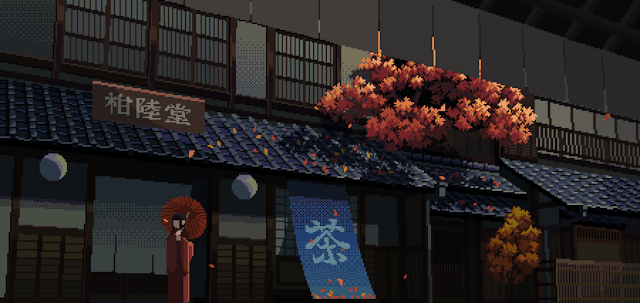

  

  
  &nbsp;&nbsp;&nbsp;
  
  &nbsp;&nbsp;&nbsp;
  

 

<h2 align="center">🪼 Beyond Code</h2>

  

    Want to see what I'm up to? Check out my thoughts, projects, and daily updates on 
    <a href="https://x.com/shivrajcodez"><b>X</b></a> — where I share the real, unfiltered journey of building cool stuff!
  

  

<h2 align="center">☕ Fuel the Builder</h2>

  If you like what I build and wanna support the grind, you can fuel the late-night coding sessions 👇

  

